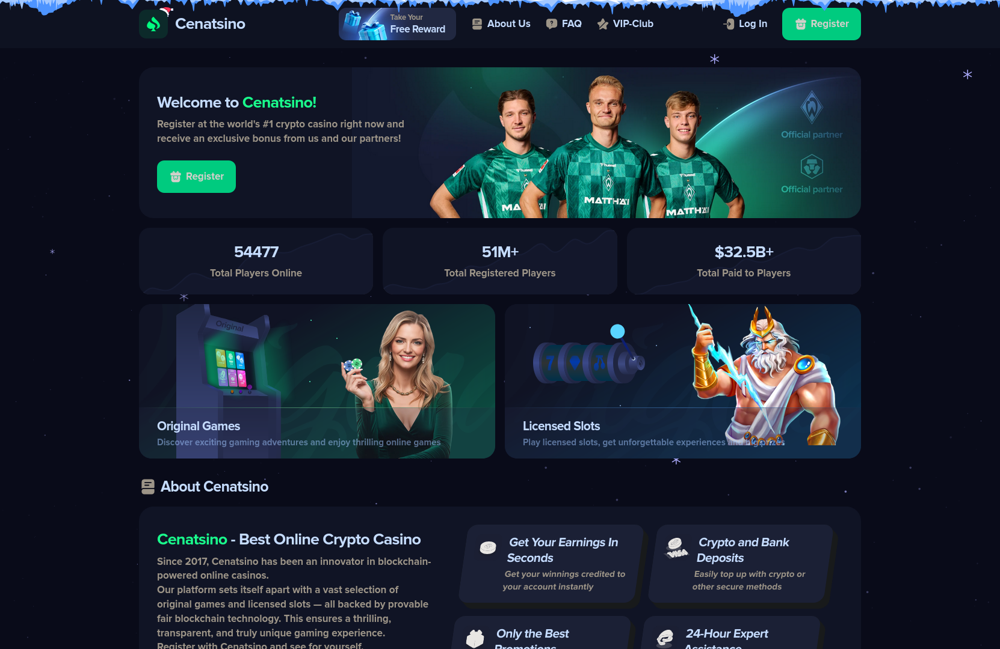
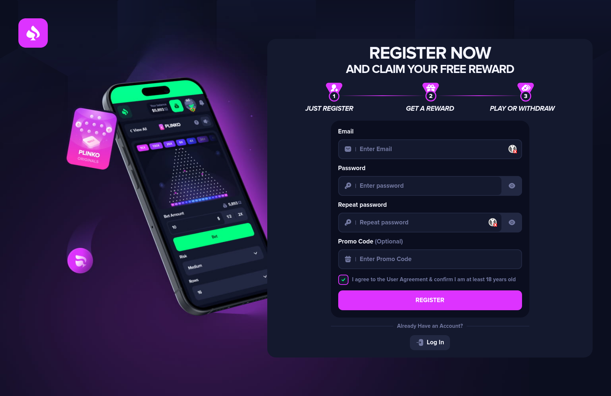
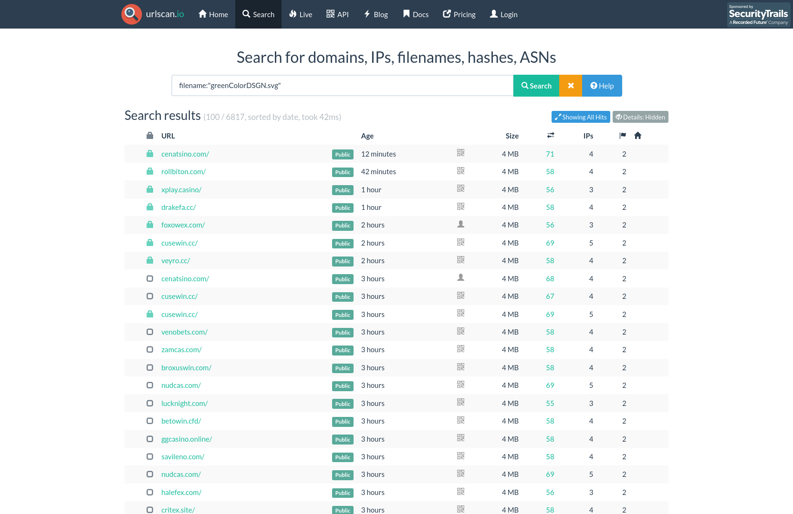
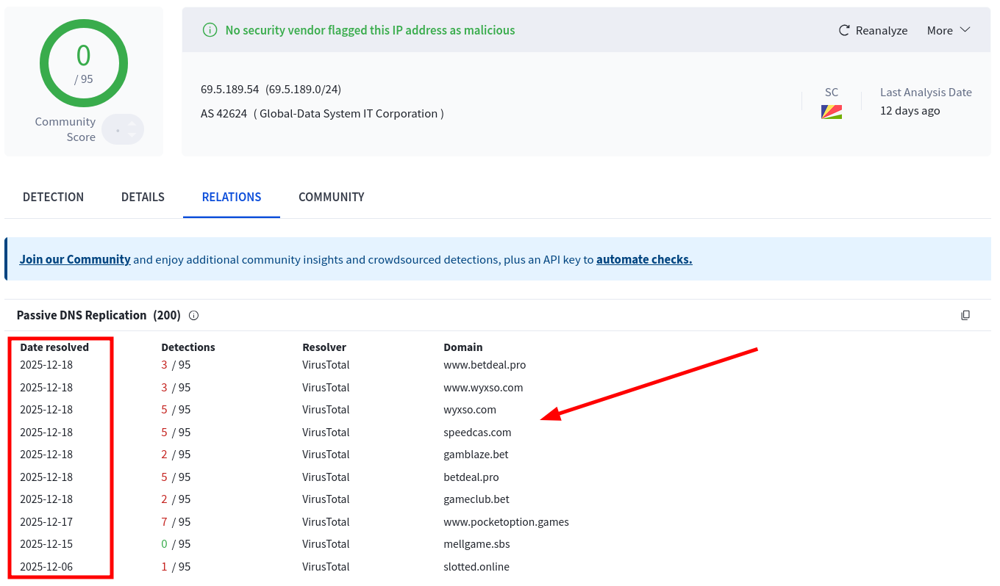
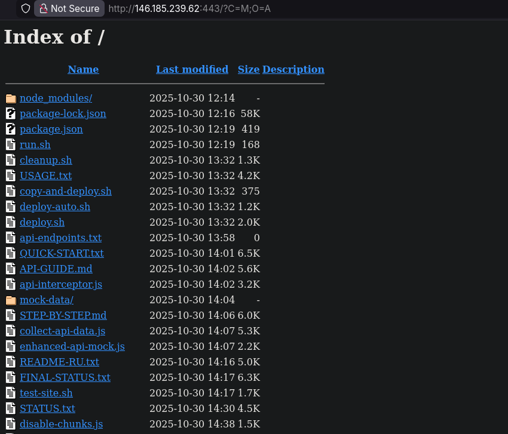
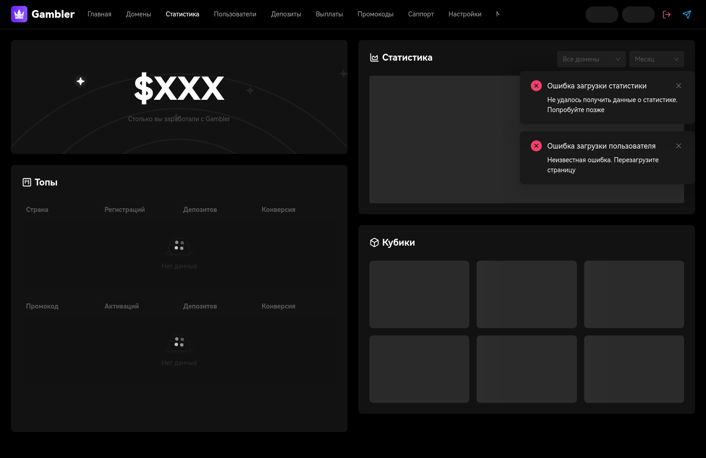
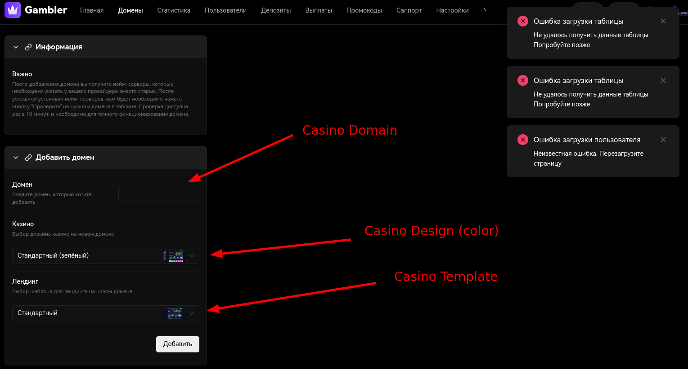
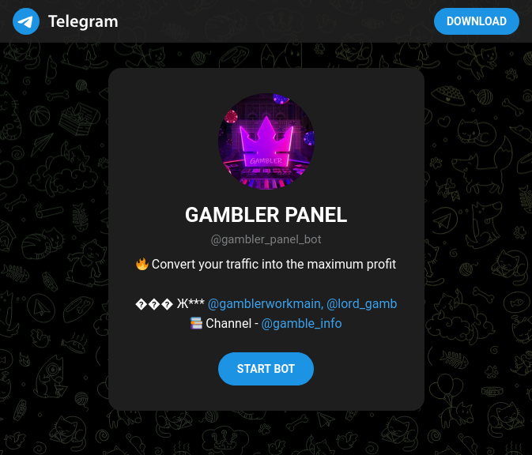
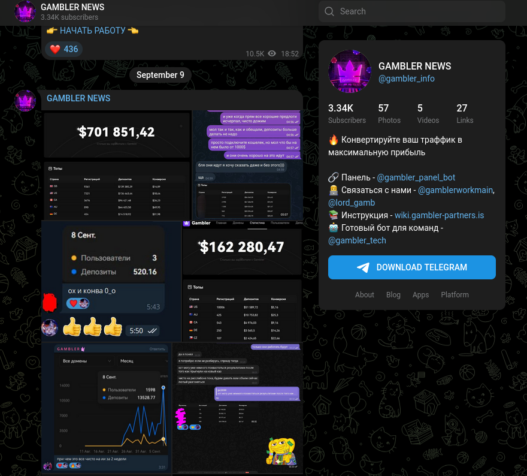
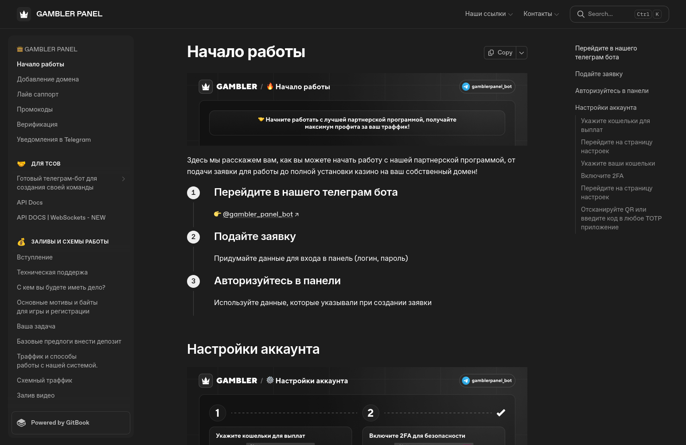

# "GAMBLER" Scam Campaign: Fake Crypto Casinos at Scale

## TL;DR

**"GAMBLER"** is a cybercriminal operation focused on the large-scale, automated deployment of fake cryptocurrency casinos. The operation is designed to monetize traffic by redirecting victims to fraudulent gambling platforms that simulate legitimate online casinos. As of December 2025, thousands of these malicious websites are still active worldwide. The group relies heavily on reusable templates, frequent domain rotation, and Cloudflare protection to slow down takedowns and evade detection.

Multiple technical indicators point to Russian-speaking developers. Deployment scripts, internal documentation, and several Telegram channels associated with the operation are written in Russian, strongly suggesting the origin of the tooling and infrastructure.


## Overview of Malicious Casinos

The campaign is built around a small number of website templates that are reused at scale. Domains are regularly changed to avoid reputation-based blocking, while the underlying structure remains largely identical across sites. These casinos are typically protected by HTTPS and proxied through Cloudflare, which hides the real server IP addresses and complicates infrastructure-level blocking.

From a visual standpoint, the casinos are easy to recognize once the patterns are known. All sites share the same UI/UX elements, layouts, and assets, with only branding and domain names changing between deployments.





## Advertising and Distribution

### Malware Delivery

Traffic is primarily driven through online advertising and social-engineering campaigns that double as malware distribution mechanisms. Malicious files are commonly hosted on legitimate third-party platforms such as MediaFire, where they are presented as harmless downloads. These files are usually ZIP archives and often use Unicode or misleading filenames to bypass basic security checks.

Once executed, the malware automatically sends messages to the victim's contacts, encouraging them to visit the fake casino websites. These messages typically include promotional language and images of the casino interface to make the offer appear legitimate.


In many cases, the attackers impersonate well-known public figures such as actors, singers, streamers, or football players to increase credibility and click-through rates (Kai Cenat is shown in the example above). To further entice victims, the casinos advertise fake bonuses or promotional rewards that supposedly unlock after a deposit is made.


## Hunting for Malicious Casinos

Despite the use of Cloudflare and frequent domain changes, the casinos can still be identified by correlating consistent technical indicators. Two of the most reliable indicators are reused favicons and highly repetitive HTML page titles.

- **Favicon**: Identical filenames and SVG content.
- **HTTP Title**: Nearly identical titles with only the casino name changed.

### Favicon Examples


### Sample Favicon Paths

The same favicon files are hosted at predictable paths across multiple domains:

```
hxxp://www.mieryshild.com/global/favicons/greenColorDSGN.svg
hxxps://goodinspin.com/global/favicons/greenColorDSGN.svg

hxxps://betdeal.pro/w/new/custom/default_2.svg
hxxps://codcas.com/w/new/custom/default_2.svg

hxxps://slotted.online/w/new/custom/gates_of_olympus.svg
```

### Sample Titles

Page titles follow very consistent naming patterns, differing only by the casino name:

```
Kardibed: Most Popular Online Crypto Casino Based on Blockchain
Cenatsino: Most Popular Online Crypto Casino Based on Blockchain

BETDEAL | Play at the Best Online Casino Based on Blockchain
CODCAS | Play at the Best Online Casino Based on Blockchain
```

### Searching for Casinos Using Favicons or Titles

These patterns make it easy to identify related domains using public scanning platforms such as [urlscan.io](https://urlscan.io/search/). Simple queries based on favicon filenames or title strings can quickly reveal thousands of casino websites.



```sql
filename:"greenColorDSGN.svg" OR filename:("/w/new/custom/~" AND ".svg")

page.title:("Most Popular Online Crypto Casino Based on Blockchain" OR "Play at the best online casino based on Blockchain")
```

For larger-scale investigations, automation is helpful. A dedicated Python script ([casino_hunt.py](./casino_hunt.py)) can be used to query the URLScan API and continuously identify new domains linked to the campaign.

### Searching for Casinos Using Passive DNS

If a non-Cloudflare origin IP address is discovered, additional infrastructure can be uncovered using Passive DNS data from platforms like [VirusTotal](https://www.virustotal.com/). This often reveals multiple casino domains pointing to the same backend server.

The attackers make extensive use of virtual hosting (VHOST), allowing them to run several casino templates on a single server and significantly reduce operational costs.



## Scam Automation

Several uncovered backend IP addresses suggest highly automated deployment processes. The incremental pattern in the final octets is particularly notable:

```
146.185.239.62
77.239.120.21
69.5.189.54
69.5.189.55
69.5.189.56
69.5.189.57
69.5.189.58
```

### Open Directory Findings

One server (`146.185.239.62`) exposed an Apache Open Directory on port 443 due to a misconfiguration (HTTP served over HTTPS). The directory contained a large amount of internal material, including:

- Static casino templates (HTML, CSS, and JavaScript files)
- Automated deployment scripts written in Bash, with comments in Russian
- Internal documentation in Russian explaining how to configure and launch new casinos



**Discovered Admin Domains**:

```
hxxps://games.tanukicode[.]one/
hxxps://panel.tanukicode[.]one/
hxxps://casino.tanukicode[.]one/
```

## Admin Panel (panel[.]tanukicode[.]one)

The admin panel serves as the central control point for the entire operation. From this interface, operators can monitor performance and manage their network of casinos. Available features include detailed statistics (such as visitors, deposits, and payouts) as well as domain and template management.




## Telegram Administration

The admin panel is tightly integrated with Telegram. Bots, channels, and user accounts are used for support, announcements, and technical updates. Operators can receive real-time notifications about deposits or user messages and respond directly from Telegram without logging into the panel.





**Full List of Telegram**:

```
hxxps://t.me/gambler_panel_bot  -- Support bot
hxxps://t.me/gambler_info       -- Announcements (3.3K users)
hxxps://t.me/gambler_tech       -- Technical updates (1K users)
hxxps://t.me/gamblerworkmain
hxxps://t.me/lord_gamb
```

## GAMBLER Wiki & Project Domains

The group maintains a public-facing wiki that acts as an onboarding and documentation hub for affiliates and operators. It includes step-by-step guides, explanations of the infrastructure, and instructions for launching new casinos.



```
hxxps://wiki[.]gambler-partners[.]is/
hxxps://wiki[.]gambler-work[.]com/
```

**Self-Description (from wiki):**

> *"GAMBLER isn't just a generic, soulless project built for profit. We are a team united by one goal: to make money. We're the first in the gambling industry to offer fully automated casino deployment—just a few clicks to launch your platform, then manage it from our dashboard."*

### GAMBLER Domains

| **Domain**          | **First Seen (crt.sh)** |
| ------------------- | ----------------------- |
| gambler-panel.com   | 2024-04-26              |
| tanukicode.one      | 2025-01-29              |
| 3gambler.xyz        | 2025-02-09              |
| gambler-partners.is | 2025-09-29              |
| gambler-work.com    | 2025-09-12              |

